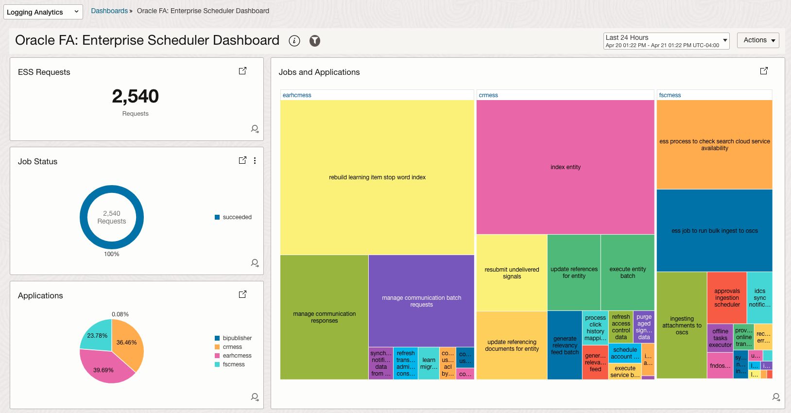
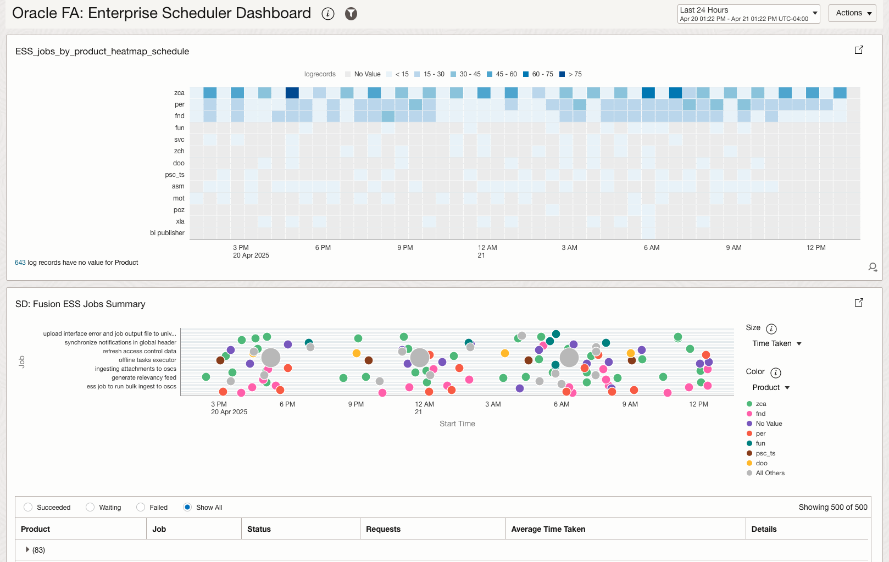
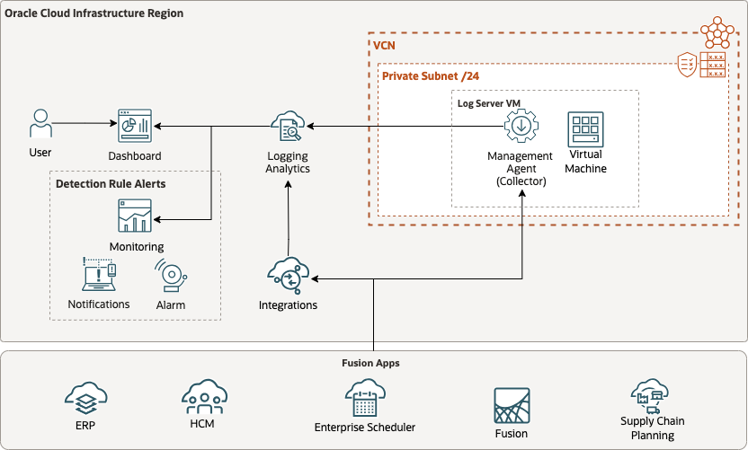
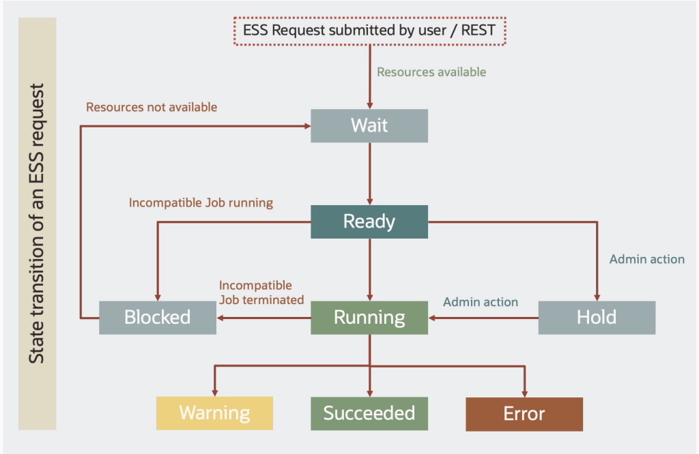
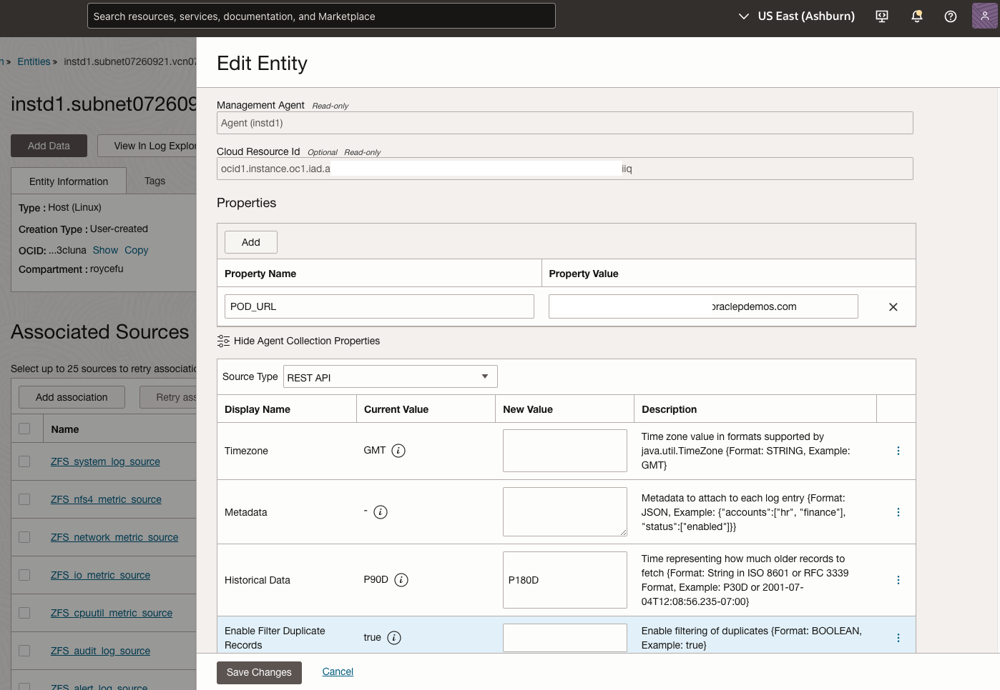
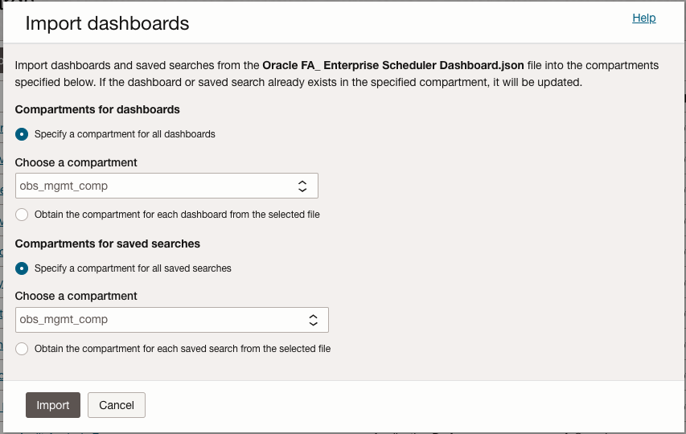
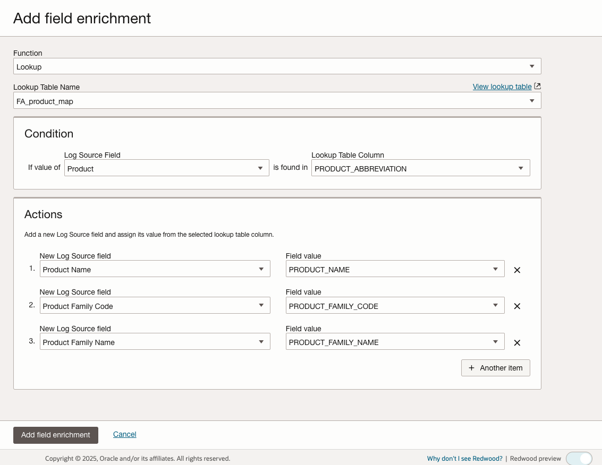

# Fusion Applications Observability by Collecting ESS Logs Using OCI Logging Analytics REST API Ingestion

Oracle Fusion Applications Enterprise Scheduler Service (ESS) is a critical component that manages scheduled processes across various Fusion Applications modules including ERP, SCM, CX, and HCM. Traditionally, Fusion Applications customers have relied on the Scheduled Processes work area within Fusion Applications to monitor their ESS processes. These scheduled processes handle complex tasks that are too time-consuming to monitor manually, such as data imports, record updates, and report generation. In this blog post, we will explore the ESS REST API endpoints to collect and analyze ESS logs using OCI Logging Analytics.

## Key Monitoring Use Cases

While Oracle Fusion Applications provides a basic Scheduled Processes work area, many customers face significant challenges when monitoring and analyzing ESS jobs at scale. The native interface lacks comprehensive monitoring capabilities, especially for enterprises running hundreds or thousands of scheduled processes across multiple modules. 

The most common use cases for monitoring Fusion Applications ESS processes are:

- ESS Job Requests and Status 
- Jobs and Applications Requests Analysis
- ESS Jobs Schedule Heatmap Analysis
- Track historical performance trends
- Correlate ESS process execution with system events
- Generate comprehensive reports across multiple processes
- Set up proactive alerts for process failures
- Analyze process execution patterns over extended periods

With the ESS job requests data collected, we can build a monitoring dashboard to visualize the ESS job requests and status, and analyze the job requests and status over time.





*Figure 1: Fusion Apps Enterprise Scheduler Job Requests and Status Dashboard*

## Solution Design

Fusion Apps provided three options to visualize and analyze the ESS job requests data:

* **Native Fusion Applications Interface**: Use the built-in Scheduled Processes work area within Fusion Applications to search and monitor jobs, though this has limitations for comprehensive monitoring at scale.

* **Custom BI Publisher Reports**: Create custom BI Publisher reports using SQL queries against ESS_REQUEST_HISTORY and ESS_REQUEST_PROPERTY tables to build tailored monitoring solutions. Oracle provides sample queries in Knowledge Base article "Additional Optimization Opportunities for Scheduled Processes (Doc ID 2820161.1)" for educational purposes.

* **Scheduler REST API**: Oracle introduced the Scheduler REST API in (23B)[https://docs.oracle.com/en/cloud/saas/applications-common/23b/farcr/index.html] to provide a RESTful interface for managing and monitoringscheduled processes. This API allows for programmatic creation, retrieval, and management of scheduled jobs, making it suitable for monitoring and automation purposes.

In this blog, we will explore the Scheduler REST API by leveraging OCI Logging Analytics' REST API log collection method to ingest ESS process job requests and status data. This approach provides a robust solution for monitoring and analyzing scheduled processes while ensuring ongoing log collection. The solution uses the Management Agent with appropriate authentication methods to securely collect and analyze ESS logs.

The solution addresses several critical monitoring requirements:

- **Complete process visibility**: Ability to collect and analyze ESS process logs comprehensively, including investigating process failures that occurred days or weeks ago
- **Historical analysis**: Track process execution patterns and performance over time, allowing you to analyze performance trends to optimize scheduling
- **Proactive monitoring**: Set up alerts for process failures and performance issues, and generate compliance reports for audit purposes
- **Automated collection**: Management Agent handles log collection based on configured intervals, enabling monitoring of process execution across multiple Fusion Applications instances

### Reference Architecture


*Figure 2: Reference Architecture showing the flow of ESS logs from Fusion Applications to OCI Logging Analytics using REST API ingestion method with Management Agent*

[Bala Mahalingam](https://blogs.oracle.com/authors/bala-mahalingam) from the A-Team has created a great blog post on the best practices for Fusion Applications ESS monitoring using the Scheduler REST API [here](https://www.ateam-oracle.com/post/introducing-the-scheduler-rest-api-and-guidelines-for-monitoring-scheduled-processes-in-fusion-cloud-applications). Based on the state transition for a submitted ESS job, you can gain insights into the job requests and status.



*Figure 3: Fusion Applications ESS job requests workflow*

## Implementation Overview

### Prerequisites

- Set up service policies for Oracle Cloud Logging Analytics. See [Enable Access to Logging Analytics and Its Resources](https://docs.oracle.com/iaas/logging-analytics/doc/enable-access-logging-analytics-and-its-resources.html) and Prerequisite IAM Policies in Oracle Cloud Infrastructure Documentation.
- Install the [Management Agent](https://docs.oracle.com/en-us/iaas/management-agents/doc/install-management-agent.html) on a client host VM which has http or https access to your Fusion Applications endpoint, we will use this host for Log Source entity association. See [Set Up Continuous Log Collection From Your Hosts](https://docs.oracle.com/en-us/iaas/logging-analytics/doc/set-continuous-log-collection-form-your-hosts.html#GUID-310D58A5-9F27-48C9-AE62-009BD094AB69).
- On Unix-based hosts, the user that installs management agent is mgmt_agent for the [manually installed management agent](https://docs.oracle.com/en-us/iaas/management-agents/doc/install-management-agent-manually.html), and oracle-cloud-agent when the management agent is a plugin enabled with [Oracle Cloud Agent](https://docs.oracle.com/en-us/iaas/Content/Compute/Tasks/manage-plugins.htm).


### Step 1: Create Integration User Account in Fusion Applications with appropriate permissions

1. Sign in to Oracle Fusion Applications using administrator privileges
2. Navigate to **My Team** > Users and Roles
3. Create a new user account with the following details:
   - **Last Name**: SERVICE_APP_ICS_ID
   - **Email**: Valid email address
   - **User Name**: SERVICE_APP_ICS_ID
   - **Person Type**: Employee
   - **Legal Employer**: Select appropriate organization
   - **Business Unit**: Select appropriate business unit

4. Configure the necessary security roles for the integration user
   - **Customer Service Representative**
   - **Employee**
   - **Resource**
   - **SVC SOA Operator**

5. Test API Access via Postman
   - Create a new Postman request
   - Set the request type to GET
   - Set the request headers to include the following:
     - **Authorization**: Basic {Base64 encoded username:password}
     - **Accept**: application/json
     - **Content-Type**: application/json; charset=UTF-8
   - Obtain the REST Server URL from the the FA admin
   - Construct the request URL by combining the REST Server URL and the appropriate resource path. For example:
   ```
   https://<servername>.fa.us2.oraclecloud.com/ess/rest/scheduler/v1/requests/search/10?fields=absParentRequestId,requestedEndTime,application,cause,causeDescription,completedTime,deployedApplicationName,description,dispatcher,dmsRID,ecid,elapsedTime,enterpriseId,errorType,errorTypeDescription,errorWarningDetail,errorWarningMessage,errorWarningTime,executableState,executionAttempt,executionMode,executionType,expiration,flowId,instanceParentExecAttempt,instanceParentId,isAsynchronous,isAsyncRecoverable,isCancellable,isForceCancelAllowed,isHoldable,isRecoverable,isTimedOut,jobDefinitionId,jobDescription,jobDisplayName,jobType,lastScheduleInstanceId,lastSubRequestSet,links,logicalClusterName,notificationUrl,parentExecAttempt,parentRequestId,pausedCount,postProcessMessage,postProcessStatus,preProcessMessage,preprocessStatus,previousState,priority,processEndTime,processGroup,processor,processPhase,processPhaseDescription,processStartTime,product,requestCategory,requestedEndTime,requestedStartTime,requestId,requestMode,requestParameters,requestType,retriedCount,runAsUser,schedule,scheduleDefinition,scheduledTime,state,stateChangeTime,stateDescription,stepId,submissionTime,submitter,submitterDmsECID,submitterDmsRID,submitterFlowId,submitterGUID,subRequestSet&orderBy=processStartTime:asc&q=processStartTime gt "2024-10-12T20:00Z" and processEndTime lt "2024-10-13T20:05Z"
   ```
   - Send the request and verify the response
   - If the response is successful, you have successfully authenticated and can proceed with the next steps
   - If the response is not successful, please check the authentication credentials and try again

### Step 2: Update the Agent Configuration 

To enable the Management Agent to use the REST API for log collection, you need to update its configuration properties:

1. SSH to the VM host where the Management Agent is installed:
   ```
   ssh opc@<your-vm-ip-address>
   ```

2. Switch to the **root** user:
   ```
   sudo su -
   ```

3. Navigate to the agent configuration directory:
   - If you're using Oracle Cloud Agent:
     ```
     cd /var/lib/oracle-cloud-agent/plugins/oci-managementagent/polaris/agent_inst/config/
     ```
   
   - If you manually installed the Management Agent (standalone installation):
     ```
     cd /opt/oracle/mgmt_agent/agent_inst/config
     ```

4. Open the **emd.properties** file for editing:
   ```
   vi emd.properties
   ```

5. Append the following two parameters to the bottom of the file:
   ```
   loganalytics.rest_api.enable_oci_api=true
   loganalytics.rest_api.report_interval=600
   ```

   Note: The `loganalytics.rest_api.report_interval` parameter sets the collection interval in seconds. The default is 300 seconds (5 minutes), but in this example, we've set it to 600 seconds (10 minutes). You can adjust this value based on your requirements.

6. Save the file and exit the editor.

7. Restart the Management Agent to apply the changes.
   ```
   systemctl restart oracle-cloud-agent
   ```

   If you use standalone Management Agent:
   ```
   systemctl restart mgmt_agent
   ```

### Step 3: Configure the Fusion Apps Credential file on Management Agent

1. SSH to the VM host where the Management Agent is installed:
   ```
   ssh opc@<your-vm-ip-address>
   ```

3. Navigate to the /home/opc directory:
   ```
   cd /home/opc
   ```
4. Create a credential file named **FA_CRED.json**
   ```
   touch FA_CRED.json
   ```

5. Add the following content to the file:
   ```
   {
      "source":"lacollector.la_rest_api",
      "name":"FA_CRED",
      "type":"HTTPSCreds",
      "description":"These are HTTPS (BasicAuth) credentials.",
      "properties":
      [
         { "name":"HTTPSUserName", "value":"CLEAR[username]" },
         { "name":"HTTPSPassword", "value":"CLEAR[password]" },
         { "name":"ssl_trustStoreType", "value":"JKS" },
         { "name":"ssl_trustStoreLocation", "value":"/etc/pki/ca-trust/extracted/java/cacerts" },
         { "name":"ssl_trustStorePassword", "value":"changeit" }
      ]
   }
   ```

   Note: Please check out this blog post to configure the truststore for the Management Agent - **Configure SSL certificate keystore and truststore to access ZFS REST API endpoint** [here](https://www.ateam-oracle.com/post/zfs-storage-appliance-observability-and-monitoring).

6. Copy the FA_CRED.json file to /tmp directory and update the permission to 755
   ```
   cp FA_CRED.json /tmp/FA_CRED.json
   chmod 755 /tmp/FA_CRED.json
   ```

7. Switch to the **root** user:
   ```
   sudo su -
   ```

8. Register the credential file with the Management Agent
   ```
   cat /tmp/FA_CRED.json | sh /var/lib/oracle-cloud-agent/plugins/oci-managementagent/polaris/agent_inst/bin/credential_mgmt.sh -o upsertCredentials -s logan
   ```
   

   *Figure 4: Management Agent Credential Management UpsertCredentials*

### Step 3: Import ESS Log Source

1. Import ESS Log Source:
   - Download the ESS Log Source configuration from github [here](https://github.com/jujufugh/oci-o11y-solutions/blob/main/knowledge-content/fa-ess-scheduler/log-sources/Oracle%20Fusion%20Apps_%20Enterprise%20Scheduler%20Service%20(ESS)_1745244403805.zip)
   - Navigate to Logging Analytics > Administration > Administration Overview
   - Click **Import Configuration Content**
   - Select the ESS Log Source file - **Oracle Fusion Apps_ Enterprise Scheduler Service (ESS)_1745244403805.zip**
   - Import the ESS Log Source configuration: **Oracle Fusion Apps_ Enterprise Scheduler Service (ESS)**

2. Validate the Log Endpoints:
   - Navigate to Logging Analytics > Administration > Sources
   - Click the **Oracle Fusion Apps_ Enterprise Scheduler Service (ESS)** log source
   - There are two log endpoints for the ESS Log Source:
      * sshishod-ess-requests-v2_1h: ESS job requests log collection with 1 hour interval
      * sshishod-ess-requests-v2: ESS job requests log collection with 1 day interval
   - Check the **Enabled** checkbox to enable specific log endpoint
   - Click **Save Changes** to apply the configuration

### Step 4: Configure Management Agent Entity Properties for log collection

1. Management Agent Collection Properties for the VM Linux Host Entity:
   - Navigate to Logging Analytics > Administration > Collection Configuration
   - Select the **Entity Configuration** tab
   - Find and select your VM Linux Host Entity
   - Click **Edit**
   - In the **Agent Collection Properties** list, locate the following properties and update them:
     - (Optional) Set **Historical Data** to **P30D** (this configures the collection to retrieve ESS logs for the past 30 days)
     - Set **Enable Filter Duplicate Records** to **true** (this prevents duplicate log entries)
   - Click **Save Changes** to apply the configuration

   

   *Figure 5: Update the Management Agent collection properties to enable historical data collection and duplicate filtering*

2. Associate the Entity with your log source and configure log group:
   - Navigate to Logging Analytics > Administration > Sources
   - Select Log Source **Oracle Fusion Apps: Enterprise Scheduler Service (ESS)**
   - Select the **Unassociated Entities** menu
   - Click **Add Association**
   - Select your Management Agent host entity
   - In the **Log Group** section, select an existing log group or create a new one for the Fusion Apps ESS logs
   - Click **Create** to finalize the association

### Step 5: Import the Oracle Fusion Apps: Enterprise Scheduler Dashboard

1. Navigate to Logging Analytics > Dashboards > Overview
2. Download the ESS monitoring dashboard from github [here](https://github.com/jujufugh/oci-o11y-solutions/blob/main/knowledge-content/fa-ess-scheduler/dashboards/Oracle%20FA_%20Enterprise%20Scheduler%20Dashboard.json)
3. Click **Import dashboards**
4. Select the dashboard file and click **Import**
5. Specify the compartment for the dashboard
6. Specify the compartment for the saved searches

   

   *Figure 6: Import ESS Monitoring Dashboard*

### Optional: Integrate Fusion Apps Product Family mapping with ESS logs

* Create User Defined Field in Logging Analytics

   

   *Figure 7: Create User Defined Field*

* Import Fusion Apps Lookup Table
   - Download the Fusion Apps Lookup file from github [here](https://github.com/jujufugh/oci-o11y-solutions/blob/main/knowledge-content/fa-ess-scheduler/lookups/Fusion_Products_Lookup.csv)
   - Navigate to **Logging Analytics** > **Administration** > **Lookups**
   - Click **Create Lookup**
   - Select Type - **Simple**
   - Select the Fusion Apps Lookup file - **Fusion_Products_Lookup.csv**
   - Click **Create**

* Add Field Enrichment to ESS Log Source
   - Select **Lookup** as Function
   - Select **FA_product_map** as Lookup Table Name
   - Select Product as the Log Source Field and PRODUCT_ABBREVIATION as the Lookup Table Column
   - Select Actionsto map the New Log Source Field with the Field Value in the Lookup Table
   - Add Field Enrichment

      

      *Figure 8: Fusion Apps product code Field Enrichment*

## Conclusion

By implementing this solution, organizations can achieve comprehensive monitoring of their Fusion Applications ESS processes. The integration with OCI Logging Analytics provides powerful capabilities for historical analysis, trend identification, and proactive monitoring. This enables organizations to optimize their scheduled processes, improve operational efficiency, and maintain compliance with business requirements.

## References

- [A-Team Oracle: Introducing the Scheduler REST API](https://www.ateam-oracle.com/post/introducing-the-scheduler-rest-api-and-guidelines-for-monitoring-scheduled-processes-in-fusion-cloud-applications)
- [A-Team Oracle: Five Key Fusion Cloud Applications Monitoring Features](https://www.ateam-oracle.com/post/five-key-fusion-cloud-applications-monitoring-features-for-better-user-adoption)
- [Oracle Fusion Applications REST API QuickStart](https://docs.oracle.com/en/cloud/saas/applications-common/24c/farca/Quick_Start.html)
- [Security User and Role Documentation](https://docs.oracle.com/en/cloud/saas/applications-common/24c/oacsm/index.html)
- [Best Practices for Scheduled Processes](https://docs.oracle.com/en/cloud/saas/applications-common/24c/fabps/how-do-i-make-sure-that-scheduled-processes-run-smoothly-and-quickly.html)
- [Oracle Fusion Financials Documentation](https://docs.oracle.com/en/cloud/saas/financials/24c/farfa/index.html)
- [Oracle Fusion Service: Create a Customer Account](https://docs.oracle.com/en/cloud/saas/fusion-service/faids/create-a-customer-account-in-oracle-fusion-service.html)
- [Oracle Fusion Service: Integration User Account](https://docs.oracle.com/en/cloud/saas/fusion-service/faiec/create-a-fusion-service-integration-user-account-for-other.html)
- [Oracle Fusion Applications REST API QuickStart (24A)](https://docs.oracle.com/en/cloud/saas/applications-common/24a/farca/Quick_Start.html)
- [Oracle Fusion Applications REST API Documentation](https://docs.oracle.com/en/cloud/saas/applications-common/24c/farca/index.html)


## Acknowledgments

**Kumar Varun** - Logging Analytics Product Management

**Bala Mahalingam** - Fusion Apps Deep Expert, A-Team Oracle